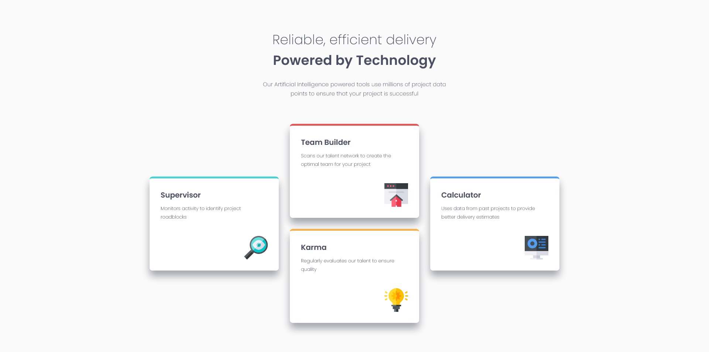

# Frontend Mentor - Four card feature section solution

This is a solution to the [Four card feature section challenge on Frontend Mentor](https://www.frontendmentor.io/challenges/four-card-feature-section-weK1eFYK). Frontend Mentor challenges help you improve your coding skills by building realistic projects.

## Table of contents

- [Overview](#overview)
  - [The challenge](#the-challenge)
  - [Screenshot](#screenshot)
  - [Links](#links)
- [My process](#my-process)
  - [Built with](#built-with)
  - [What I learned](#what-i-learned)
  - [Continued development](#continued-development)
  - [Useful resources](#useful-resources)
- [Author](#author)
- [Acknowledgments](#acknowledgments)

## Overview

### The challenge

Users should be able to:

- View the optimal layout for the site depending on their device's screen size

### Screenshot



### Links

- Solution URL: [Add solution URL here](https://your-solution-url.com)
- Live Site URL: [Add live site URL here](https://your-live-site-url.com)

## My process

### Built with

- Semantic HTML5 markup
- CSS custom properties
- Flexbox
- CSS Grid/ Grid areas

### What I learned

Best lesson I learned is about grid-template-areas and how easy it makes to layout each card/function to an area of the grid.

```css
.wrapper {
  padding-inline: 2rem;
  display: grid;
  grid-gap: 30px;
  grid-template-columns: 350px 350px 350px;
  grid-template-areas:
    ".......... teambuilder .........."
    "supervisor teambuilder calculator"
    "supervisor karma calculator"
    ".......... karma ..........";
  justify-content: center;
  margin-top: 60px;
  margin-inline: auto;
}
```

### Continued development

Future projects I will learn to make webpages mobile first. Also properly learn about wrapping so that the cards do not hide behind the shrinking window.

### Useful resources

- [Grid by Example (Grid Areas)](https://gridbyexample.com/examples/example11/) - This resource taught me about grid areas that made layout of the cards much easier than expected.

## Author

- Website - [AnalystKAL](https://github.com/AnalystKAL)
- Frontend Mentor - [@AnalystKAL](https://www.frontendmentor.io/profile/AnalystKAL)

## Acknowledgments

Thanking Frontend Mentor for providing this challenge and helpful resources in the learning paths to guide us towards the solution. Also thanking Rachel Andrew for their Grid by Example website on teaching about grid areas.
